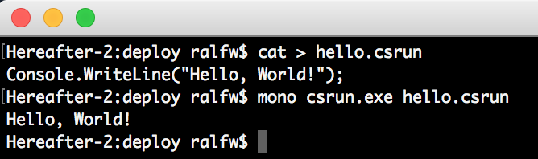
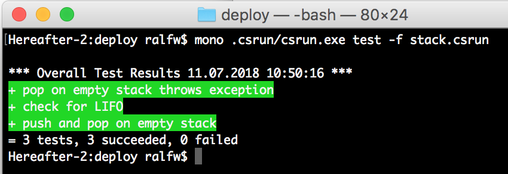
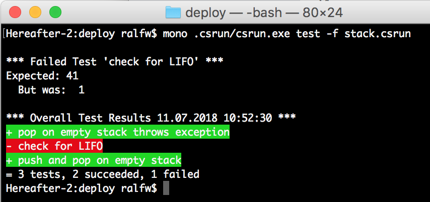
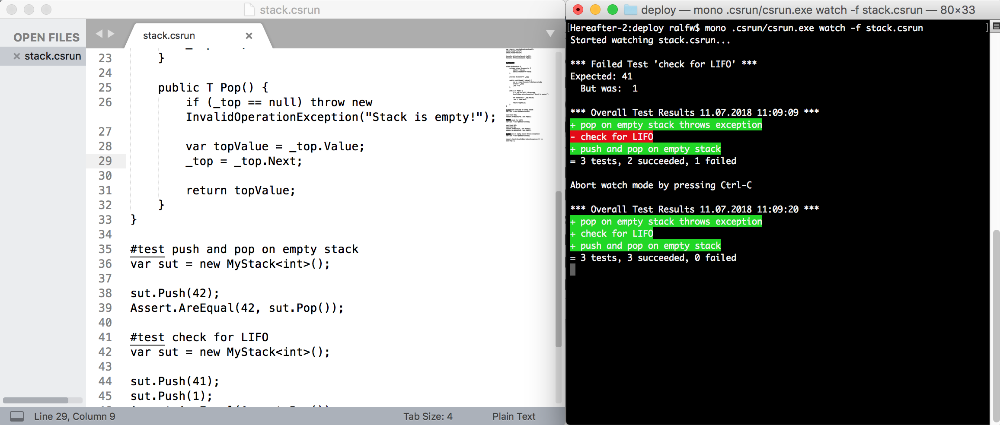

# csrun - A Simple Console Runner for Csharp

There are a lot of REPL tools for running C# interactively. You might even be able to do that right in your IDE, e.h. JetBrains Rider.

The purpose of such tools is to explore the language and to spike small solutions. It's is not an educational purpose.

However, education would benefit from a more simplified coding experience. Confronting a beginner of C# (or even programming) with a massive tool like Visual Studio or Rider is counter productive. She will find it hard to get done what's on her mind. Important features for the moment are hidden among a flurry of irrelevant features.

[Enter csrun]

*csrun* is not an IDE, it's not a REPL, it's just a runner. It runs "simplified" C# code in `.csrun`files.

Here's an example:

```
Console.WriteLine("Hello, World!");
```

Stored in the file `hello.csrun` it can be run like this:

`csrun.exe hello.csrun`

and will produce the output expected.




## File Structure
`.csrun` files have a simple structure. They may contain three sections:

* main
* functions
* tests

Which are represented like this in a `.csrun` file:

```
... // main statements
#functions
... // function definitions
#test some test
... // test statements
#test another test
... // test statements
```

### Main Section
The main section starts at the beginning of a `.csrun` file and extends until another section begins.

The main section may only contain statements. No function definitions, no type definitions, not namespaces allowed. Think of the main section as being the body of the `Main()` method.

Look at the `template.cs` file accompanying the executable. You'll see how true this is.

The main section is what motivated me to write *csrun* in the first place. I wanted to get rid of the noise which the `using` statements, the necessary class around all functions, and the necessary function `Main()` present to the novice.

With *csrun* C# can be used like a scripting language. No object-oriented frills needed.

If a teacher poses the problem

> Write a program which squares a number entered by the user.

the student can solve it by simply writing

```
Console.Write("Enter number to square: ");
var input = Console.ReadLine();
var number = int.Parse(input);

var square = number * number;

Console.WriteLine($"{number} squared equals {square}");
```

*csrun* let's beginners of C# focus!

### #functions Section
After writing statements, calling functions, and using objects "as is" students are ready for the next level: composing their own functions.

That can be done in the `#functions` sections of a `.csrun` file:

```
Console.Write("Enter number to square: ");
var input = Console.ReadLine();
var number = int.Parse(input);

Console.WriteLine($"{number} squared equals {Square(number)}");

#functions
int Square(int a) => a*a;
```

Any function definitions just have to be done after a section heading `#functions`.

*csrun* is for real beginners. Of them I don't expect to define a lot of types of their own. Functions, though, is a different matter. They are the first thing you need if you want to write programs beyond the trivial. That's why the section is titled `#function`.

However, if need be, types can be defined in that section, too:

```
var stack = new MyStack<string>();
stack.Push("world");
stack.Push("hello");

Console.WriteLine(stack.Pop());
Console.WriteLine(stack.Pop());

#functions

class MyStack<T> {
	private class Element<T> {
		public T Value;
		public Element<T> Next;
	}

	private Element<T> _top;

	public void Push(T value) {
		var e = new Element<T>{Value=value};
		e.Next = _top;
		_top = e;
	}

	public T Pop() {
		if (_top == null) throw new InvalidOperationException("Stack is empty!");

		var topValue = _top.Value;
		_top = _top.Next;

		return topValue;
	} 
}
```

Before unleashing Visual Studio or the like on the student she can achieve quite some proficiency in using *just the language*. Nothing more than a simple text editor and *csrun* are needed.

### #test Section
But what would initial programming education be today without automated testing? My belief is that automated testing should be taught almost from day 1 on. At lasted it should be introduced as soon as students know how to write their own functions.

But doing automated testing in an IDE is not that easy. Tests need to be specifically devised and run with a their own tool. Visual Studio and Rider make that easy for the pro - but for the novice it's hidden behind a lot of feature fog.

*csrun* to the rescue. Testing as easy as writing a call to some `Assert` function.

```
... // main as before

#functions

class MyStack<T> {
    ... // stack code as before
}

#test push and pop on empty stack
var sut = new MyStack<int>();

sut.Push(42);
Assert.AreEqual(42, sut.Pop());

#test check for LIFO
var sut = new MyStack<int>();

sut.Push(41);
sut.Push(1);
Assert.AreEqual(1, sut.Pop());
Assert.AreEqual(41, sut.Pop());

#test pop on empty stack throws exception
var sut = new MyStack<int>();

Assert.Catch<InvalidOperationException>(() => sut.Pop());

```

Each test starts with its own `#test` section. A short description for the test follows the section label.

Like with the main section tests consist only of statements. Think of each test section as being the body of a regular test function.

Please note: *csrun* uses [NUnit](https://github.com/nunit/docs). All standard NUnit `Assert` functions can be used.

## Running `.csrun` Code
### Running Code in Main Section
The simplest way to run `.csrun` code is to start `csrun.exe` with a `.csrun` filename:

`csrun.exe stack.csrun`

Alternatively use: `csrun.exe -f stack.csrun`

This runs the code in the main section.

### Running Tests
To run the tests you have to start *csrun* like this:

`csrun.exe test -f stack.csrun`

This produces an output like this:



All tests are run and for each test its success status is shown in green - or red:



No excuses anymore to not introduce automated testing very early in programming education.

#### Continuously Running Tests
When focused on implementing a solution it can be hard to remember not only to write tests but also to run them.

Fortunately *csrun* is here to help! When started in watch mode it will run all tests whenever the source file changes.

`csrun.exe watch -f stack.csrun`

Running tests thus is just one keystroke away: pressing `Ctrl-S` (or `Cmd-S`) to save the source code file.

Here you see a text editor side-by-side with a watching *csrun*:



Initially the implementation was buggy (red test). But after correcting and saving it the tests immediately became all green.

## Installation
When you run the `deploy.sh` script (after building the solution) in the `pipeline/` directory a folder `deploy` is created.

It contains `example.csrun` and a subfolder `.csrun`. That's where the binaries are copied to. I think they should not contaminate the source directory. Too much noise, again.

The way to use *csrun* thus is:

1. Copy the contents of the `deploy` directory to the student's computer (on which .NET/Mono needs to be installed), e.g. create a directory named `learncsharp`.
2. Open a terminal window on `learncsharp`.
3. Run the example like so: `.csrun/csrun.exe example.csrun` (on Mono add `mono` in front of the call)

